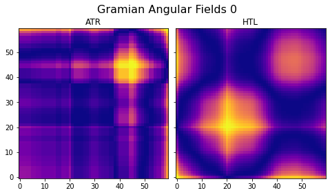
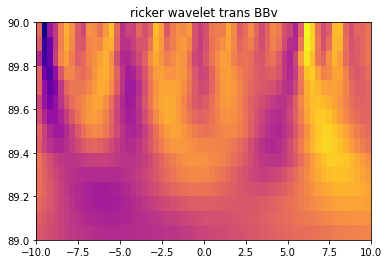

#Torch Time-Series -> Image Binary Classifier


This project trains a torch (pywarm) image classifier to classify a local maximum in a financial time series. By default, training samples consist of a 3 channel image tensor produced using a combination of wavelet transforms and Gramian Angular Field  transforms of a time-series subsequence of 60 points.

The data pre-processes reads financial data (ohlcv), produces TA columns, identifies local peaks in the time series, and then generates labeled images from time-series subsequences. These labels are binary, where `0` is a subsequence (or image) >8 points from a peak, and `1` is a subsequence ending right before a peak.

The tensor_agg currently makes a 3 channel image tensor, with one wavelet transform (of BollingerBand.diff or BBv by default) and two channels of Gramian Angular Field transforms (Ichimoku Kijun-sen and Hilbert Transform Trendline by default). These can be changed, but are limited to 3 channels due to CNN architecture. 

An optional Bokeh plot can be generated (but may be quite large) that includes peaks and many nomralzied indicator data.

Options for tensor_agg data are below:
```
['open', 'high', 'low', 'close', 'volume', 'date', 'MA60', 'MA200',
       'MA400', 'MA800', 'HTL', 'UBB', 'BB', 'LBB', 'RSI', 'MOM', 'DX', 'ATR',
       'AD', 'ichi0', 'ichi1', 'ichi2', 'ichi3', 'ichi4', 'HTBB', 'HTBB_v',
       'BBv', 'dBB', 'brLBB', 'ichspan', 'UBBv', 'LBBv', 'deltma', 'deltma_v',
       'RSI_v', 'volume_v', 'close_v']
       
```


Below is an example of 2 Gramian Angular Fields for Avergae True Range (ATR) and Hilbert Transform Trendline (HTL).



And here is an example of a ricker wavelet transform of the Bollinger Band derivative (.diff())


       
